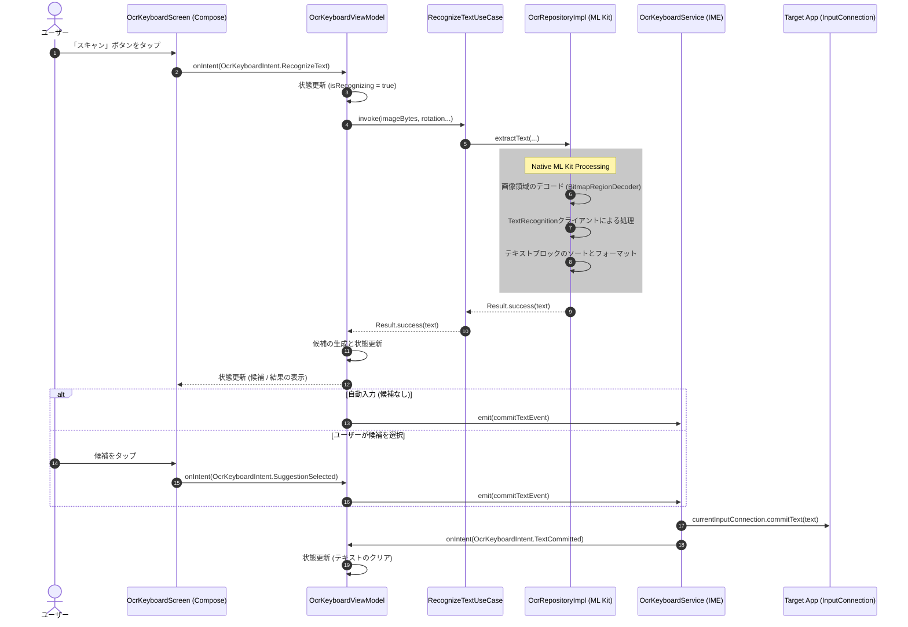

# アーキテクチャ概要

本書は、OCR Keyboardアプリケーションのコアアーキテクチャとデータフローについて説明します。

## コアコンポーネント

1.  **`OcrKeyboardService`**: アプリケーションのエントリーポイント。`LifecycleInputMethodService`（Jetpack ComposeをサポートするためのAndroidの`InputMethodService`のラッパー）を拡張。`InputConnection`を介したUI層とAndroidの入力システムの橋渡し。
2.  **UI層 (Jetpack Compose)**: `OcrKeyboardScreen`とそのサブコンポーネントによるカメラプレビュー、コントロール、認識結果の描画。UIの単方向データフロー（UDF）の厳格な遵守。
3.  **`OcrKeyboardViewModel`**: UIの状態（`OcrKeyboardState`）の管理、およびユーザーのインテント（`OcrKeyboardIntent`）の処理。UI層とドメイン層間のメディエーター機能。
4.  **ドメイン・データ層**: `RecognizeTextUseCase`によるOCRロジックのカプセル化と`OcrRepositoryImpl`への委譲。リポジトリによる`BitmapRegionDecoder`を使用した画像の切り抜きや、Google ML Kitを使用したテキスト抽出などの処理。

## OCRデータフロー

以下のシーケンス図は、ユーザーが画像をキャプチャしてから、対象のアプリケーションにテキストが挿入されるまでのエンドツーエンドのプロセスを示しています。

## 主要なアーキテクチャ制約

*   **ローカル処理のみ**: すべてのML Kit処理のデバイス上での実行。画像や抽出されたテキストの外部サーバーへの送信の禁止。
*   **単方向データフロー (UDF)**: UIコンポーネントによる直接的な状態変更やリポジトリとの通信の禁止。すべてのアクションのインテントを介したViewModelへの伝達。
*   **メモリ効率**: `Bitmap.Config.RGB_565`を指定した`BitmapRegionDecoder`の使用による、ML Kitへの引き渡し前の高解像度カメラ映像切り抜き時のメモリ割り当ての最小化。
