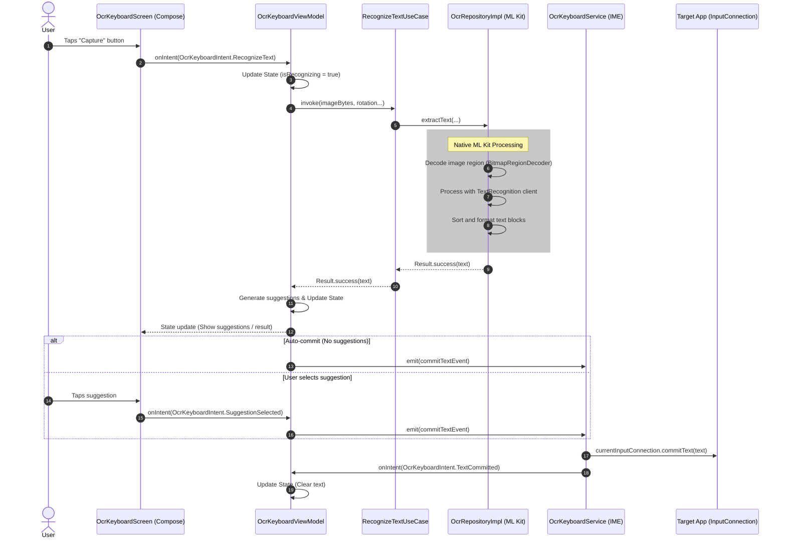

# Architecture Overview

This document outlines the core architecture and data flow for the OCR Keyboard application.

## Core Components

1.  **`OcrKeyboardService`**: The entry point of the application. It extends `LifecycleInputMethodService` (a wrapper around Android's `InputMethodService` to support Jetpack Compose). It is responsible for bridging the UI layer with the Android input system via `InputConnection`.
2.  **UI Layer (Jetpack Compose)**: `OcrKeyboardScreen` and its sub-components render the camera preview, controls, and recognition results. The UI strictly adheres to Unidirectional Data Flow (UDF).
3.  **`OcrKeyboardViewModel`**: Manages the UI state (`OcrKeyboardState`) and processes user intents (`OcrKeyboardIntent`). It acts as a mediator between the UI and the Domain layer.
4.  **Domain & Data Layers**: `RecognizeTextUseCase` encapsulates the OCR logic, delegating to `OcrRepositoryImpl`. The repository handles the heavy lifting of image cropping via `BitmapRegionDecoder` and text extraction using Google ML Kit.

## OCR Data Flow

The following sequence diagram illustrates the end-to-end process from the moment a user captures an image to the text being inserted into the target application.

## Key Architectural Constraints

*   **Local Processing Only**: All ML Kit processing occurs on-device. No images or extracted text are ever sent to a remote server.
*   **Unidirectional Data Flow (UDF)**: The UI components do not directly modify state or communicate with the repository. All actions flow through intents to the ViewModel.
*   **Memory Efficiency**: The repository uses `BitmapRegionDecoder` with `Bitmap.Config.RGB_565` to minimize memory allocation when cropping high-resolution camera feeds before passing them to ML Kit.
